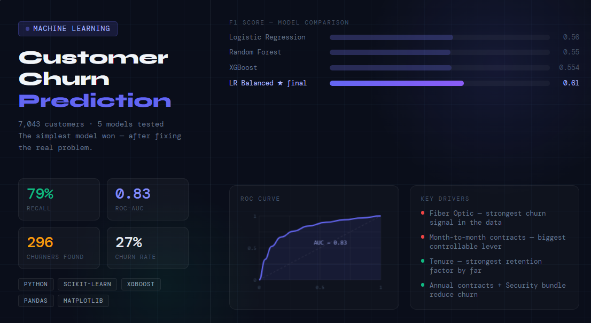
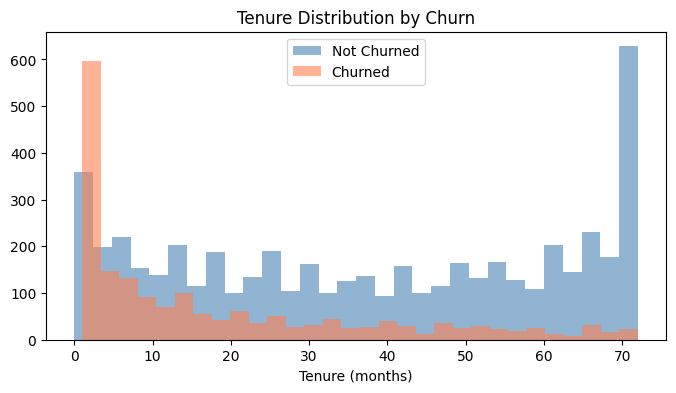
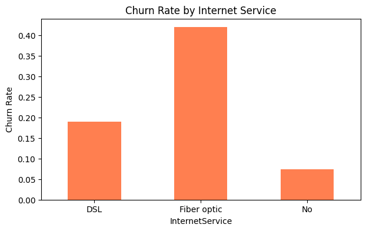
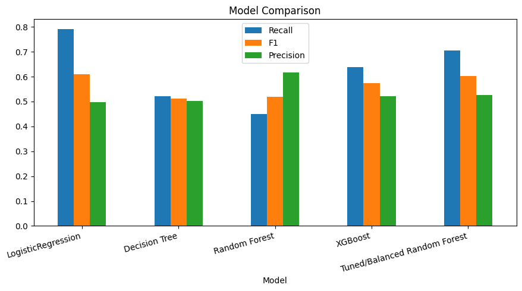
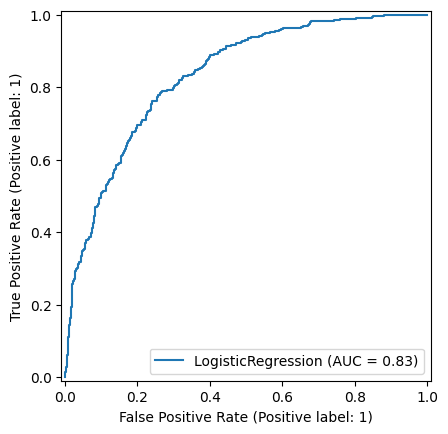
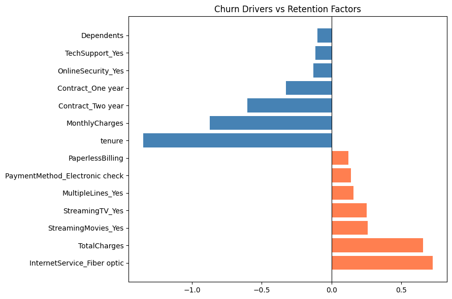

# 📉 Customer Churn Prediction


---

> 7,043 customers. 27% churned. 5 models tested. The simplest model won — but only after fixing the real problem.

---



## The Problem

Acquiring a new customer costs 5–7× more than keeping an existing one.
That makes churn a revenue problem first, and a modeling problem second.

This project builds a full ML pipeline to predict which customers are at risk,
understand why they leave, and give the business something it can act on.

---

## Key Results

```
✅ Recall improved from 51% → 79% after handling class imbalance
✅ ROC-AUC of 0.83 — model meaningfully separates churners from non-churners
✅ 296 out of 374 churners correctly identified
✅ Balanced Logistic Regression outperformed Random Forest and XGBoost on F1
⚠️ Fiber Optic customers churn at a disproportionately high rate
⚠️ Month-to-month contracts are the strongest controllable churn driver
⚠️ Increasing model complexity did not help — the signal in this data is largely linear
```

---

## Visuals

### Churn by Tenure


> Customers who churn have significantly lower tenure.
> The first 6 months are the highest-risk window — new customers leave the most.
> This is the strongest single signal in the dataset.

---

### Churn by Internet Service


> Fiber Optic customers churn at a disproportionately high rate compared to DSL.
> This is not a data anomaly — it shows up in both the EDA and the model coefficients.
> It likely reflects a service quality or pricing issue worth a dedicated investigation.

---

### Model Comparison


> Random Forest and XGBoost both lost to a well-configured Logistic Regression.
> The relationships in this data are largely linear — adding complexity only added noise.

---

### ROC Curve — AUC 0.83


> AUC of 0.83 means the model correctly ranks a random churner above a random
> non-churner 83% of the time. Useful beyond a single threshold — the business
> can choose how aggressive it wants to be with outreach.

---

### Churn Drivers vs Retention Factors


> Positive coefficients push toward churn. Negative ones push toward retention.
> Fiber Optic and month-to-month contracts are the strongest churn signals.
> Tenure and annual contracts are the strongest retention factors.
> This chart is what turns a prediction into a recommendation.

---

## Code Highlights

### Why accuracy was not enough

```python
LR = LogisticRegression()
LR.fit(X_train, y_train)
y_prediction = LR.predict(X_test)

accuracy = accuracy_score(y_test, y_prediction)   # 0.80 — looks great
recall   = recall_score(y_test, y_prediction)      # 0.51 — this is the problem

# Recall of 0.51 means the model missed half the churners
# The model learned to predict 'stay' most of the time
# High accuracy here is misleading
```

---

### The fix — one parameter, big difference

```python
# 73% of customers did not churn — the model was ignoring the minority class
df['Churn'].value_counts(normalize=True)
# No     0.734
# Yes    0.266

# class_weight='balanced' increases the penalty for missing a churner
LR_balanced = LogisticRegression(random_state=42, class_weight='balanced')
LR_balanced.fit(X_train, y_train)

# Before: Recall = 0.51 | F1 = 0.56
# After:  Recall = 0.79 | F1 = 0.61
# Precision dropped from 0.62 → 0.50 — expected and acceptable
```

---

### Why complexity did not help

```python
models = {
    'LogisticRegression': LogisticRegression(random_state=42, class_weight='balanced'),
    'DecisionTree':       DecisionTreeClassifier(random_state=42, class_weight='balanced'),
    'RandomForest':       RandomForestClassifier(random_state=42, class_weight='balanced'),
    'XGBoost':            XGBClassifier(random_state=42, scale_pos_weight=2.76),
    'Tuned_RandomForest': Best_Random_Forst_tuned_balanced
}

# Logistic Regression still won on F1 and Recall
# Contract type, tenure, fiber optic — these are clean, linear separators
# Boosting on top of a linear problem just adds noise
```

---

### Reading the model — what actually drives churn

```python
coef_df = pd.DataFrame({
    'Feature':     X.columns,
    'Coefficient': LR_balanced.coef_[0]
})

# Top churn drivers (most positive)
coef_df.sort_values('Coefficient', ascending=False).head(3)
# InternetService_Fiber optic     → strongest churn signal
# PaymentMethod_Electronic check  → second strongest
# Contract_Month-to-month         → expected

# Top retention factors (most negative)
coef_df.sort_values('Coefficient').head(3)
# tenure              → strongest retention signal by far
# Contract_Two year   → customers who commit, stay
# OnlineSecurity_Yes  → security bundle reduces churn
```

---

## Business Recommendations

| Priority | Action | Why |
|---|---|---|
| 🔴 Critical | Target customers in months 1–6 | Churn risk peaks in early tenure — highest leverage window |
| 🔴 Critical | Incentivize month-to-month → annual upgrade | Biggest controllable churn lever in the data |
| 🟠 High | Investigate Fiber Optic service quality | Highest churn rate of any service segment |
| 🟠 High | Bundle Security + Tech Support | Both features reduce churn probability significantly |
| 🟡 Medium | Review Electronic Check payment experience | Higher churn rate suggests friction or dissatisfaction |

---

## Model Performance Summary

| Model | Accuracy | Precision | Recall | F1 |
|---|---|---|---|---|
| Logistic Regression | 0.800 | 0.620 | 0.510 | 0.560 |
| Random Forest (tuned) | 0.798 | 0.656 | 0.473 | 0.550 |
| XGBoost | 0.797 | 0.635 | 0.490 | 0.554 |
| **LR Balanced (final)** | **0.730** | **0.500** | **0.790** | **0.610** |

---

## Stack

Python · Pandas · NumPy · Scikit-learn · XGBoost · Matplotlib · Seaborn · Jupyter Notebook

---

## Files

```
├── Customer_Churn.ipynb                    # Full notebook
├── WA_Fn-UseC_-Telco-Customer-Churn.csv   # Dataset
├── charts/                                # All visuals
└── README.md
```

---

**Saleh Hossam** · Data Analyst
[LinkedIn](https://www.linkedin.com/in/YOUR-SLUG-HERE) · [GitHub](https://github.com/Saleh-Hossam)
